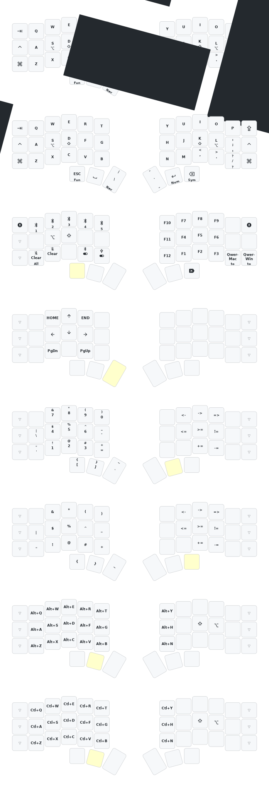

> [!IMPORTANT]
>
> **Please use the [Online ZMK Editor](https://nickcoutsos.github.io/keymap-editor) to build firmware with GitHub actions.**

> [!IMPORTANT]
>
> **For macOS, please swap "Command" and "Option" in keyboard settings.**

## Acknowledgement

- Forked from [a741725193/zmk-config-zen-2](https://github.com/a741725193/zmk-config-zen-2).
- ZMK keymap edited by [nickcoutsos/keymap-editor](https://github.com/nickcoutsos/keymap-editor).
- Keymap image generated by [caksoylar/keymap-drawer](https://github.com/caksoylar/keymap-drawer).
- Keyboard icons picked from [material design icons](https://pictogrammers.com/library/mdi/).
